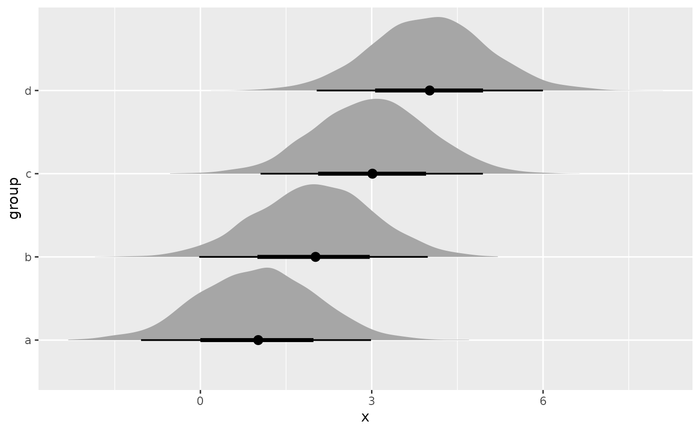

# rvar: The Random Variable Datatype

## Introduction

This vignette describes the
[`rvar()`](https://mc-stan.org/posterior/dev/reference/rvar.md)
datatype, a multidimensional, sample-based representation of random
variables designed to act as much like base R arrays as possible (e.g.,
by supporting many math operators and functions). This format is also
the basis of the
[`draws_rvars()`](https://mc-stan.org/posterior/dev/reference/draws_rvars.md)
format.

The [`rvar()`](https://mc-stan.org/posterior/dev/reference/rvar.md)
datatype is inspired by the [rv](https://cran.r-project.org/package=rv)
package and [Kerman and Gelman
(2007)](https://doi.org/10.1007%2Fs11222-007-9020-4), though with a
slightly different backing format (multidimensional arrays). It is also
designed to interoperate with vectorized distributions in the
[distributional](https://pkg.mitchelloharawild.com/distributional/)
package, to be able to be used inside
[`data.frame()`](https://rdrr.io/r/base/data.frame.html)s and
[`tibble()`](https://tibble.tidyverse.org/reference/tibble.html)s, and
to be used with distribution visualizations in the
[ggdist](https://mjskay.github.io/ggdist/) package.

## The `rvars` datatype

The [`rvar()`](https://mc-stan.org/posterior/dev/reference/rvar.md)
datatype is a wrapper around a multidimensional array where the first
dimension is the number of draws in the random variable. The most direct
way to create a random variable is to pass such an array to the
[`rvar()`](https://mc-stan.org/posterior/dev/reference/rvar.md)
function.

For example, to create a “scalar” `rvar`, one would pass a
one-dimensional array or a vector whose length (here `4000`) is the
desired number of draws:

``` r
x <- rvar(rnorm(4000, mean = 1, sd = 1))
x
```

    ## rvar<4000>[1] mean ± sd:
    ## [1] 1 ± 1

The default display of an `rvar` shows the mean and standard deviation
of each element of the array.

We can create random vectors by adding an additional dimension beyond
just the draws dimension to the input array:

``` r
n <- 4   # length of output vector
x <- rvar(array(rnorm(4000*n, mean = 1, sd = 1), dim = c(4000, n)))
x
```

    ## rvar<4000>[4] mean ± sd:
    ## [1] 1.01 ± 0.99  1.02 ± 0.99  0.98 ± 1.00  0.99 ± 1.02

Or we can create a random matrix:

``` r
rows <- 4
cols <- 3
x <- rvar(array(rnorm(4000 * rows * cols, mean = 1, sd = 1), dim = c(4000, rows, cols)))
x
```

    ## rvar<4000>[4,3] mean ± sd:
    ##      [,1]         [,2]         [,3]        
    ## [1,] 1.00 ± 0.98  1.00 ± 1.00  0.97 ± 1.00 
    ## [2,] 1.00 ± 1.01  1.01 ± 1.02  0.99 ± 0.99 
    ## [3,] 1.02 ± 1.01  0.99 ± 1.00  1.00 ± 0.99 
    ## [4,] 1.01 ± 1.01  1.02 ± 1.00  1.00 ± 1.01

Or any array up to an arbitrary number of dimensions. The array backing
an `rvar` can be accessed (and modified, with caution) via
[`draws_of()`](https://mc-stan.org/posterior/dev/reference/draws_of.md):

``` r
str(draws_of(x))
```

    ##  num [1:4000, 1:4, 1:3] -0.6879 0.0448 0.3519 1.261 -0.2197 ...
    ##  - attr(*, "dimnames")=List of 3
    ##   ..$ : chr [1:4000] "1" "2" "3" "4" ...
    ##   ..$ : NULL
    ##   ..$ : NULL

While the above examples assume all draws come from a single chain,
`rvar`s can also contain samples from multiple chains. For example, if
your array of draws has iterations as the first dimension and chains as
the second dimension, you can use `with_chains = TRUE` to create an
`rvar` that includes chain information:

``` r
iterations <- 1000
chains <- 4
rows <- 4
cols <- 3
x_array <- array(
  rnorm(iterations * chains * rows * cols, mean = 1, sd = 1),
  dim = c(iterations, chains, rows, cols)
)
x <- rvar(x_array, with_chains = TRUE)
x
```

    ## rvar<1000,4>[4,3] mean ± sd:
    ##      [,1]         [,2]         [,3]        
    ## [1,] 0.97 ± 1.00  1.00 ± 0.99  1.02 ± 0.99 
    ## [2,] 1.02 ± 1.00  0.99 ± 1.01  1.01 ± 0.99 
    ## [3,] 1.00 ± 1.00  1.00 ± 1.00  1.01 ± 1.00 
    ## [4,] 1.03 ± 0.99  1.05 ± 1.00  0.98 ± 1.00

Manual construction and modification of `rvar`s in this way is not
always recommended unless you need it for performance reasons: several
other higher-level interfaces to constructing and manipulating `rvar`s
are described below.

### `rvar_factor` and `rvar_ordered` subtypes

You can also use `rvar`s to represent discrete distributions, using the
[`rvar_factor()`](https://mc-stan.org/posterior/dev/reference/rvar_factor.md)
and
[`rvar_ordered()`](https://mc-stan.org/posterior/dev/reference/rvar_factor.md)
subtypes. If you attempt to create an `rvar` using character values or a
`factor`, it will automatically be treated as an `rvar_factor`:

``` r
x <- rvar(sample(c("a","b","c"), 4000, prob = c(0.7, 0.2, 0.1), replace = TRUE))
x
```

    ## rvar_factor<4000>[1] mode <entropy>:
    ## [1] a <0.74> 
    ## 3 levels: a b c

Numeric arrays with a `"levels"` attribute can also be passed to
[`rvar_factor()`](https://mc-stan.org/posterior/dev/reference/rvar_factor.md).
This (along with conversion of character values) means output from
`rstanarm::posterior_predict()` and `brms::posterior_predict()` on
categorical models can be passed directly to
[`rvar_factor()`](https://mc-stan.org/posterior/dev/reference/rvar_factor.md).

The default display shows the mode (as returned by
[`modal_category()`](https://mc-stan.org/posterior/dev/reference/modal_category.md))
and normalized entropy
([`entropy()`](https://mc-stan.org/posterior/dev/reference/entropy.md)),
which is Shannon entropy scaled by the maximum possible entropy for a
distribution with the same number of levels: thus 0 means all
probability is concentrated in one category, and 1 means the
distribution is uniform.

You can construct an ordered factor using
[`rvar_ordered()`](https://mc-stan.org/posterior/dev/reference/rvar_factor.md)
(or by passing an [`ordered()`](https://rdrr.io/r/base/factor.html)
vector to
[`rvar()`](https://mc-stan.org/posterior/dev/reference/rvar.md)):

``` r
x <- rvar_ordered(sample(c("a","b","c"), 4000, prob = c(0.7, 0.2, 0.1), replace = TRUE))
x
```

    ## rvar_ordered<4000>[1] mode <dissent>:
    ## [1] a <0.55> 
    ## 3 levels: a < b < c

For
[`rvar_ordered()`](https://mc-stan.org/posterior/dev/reference/rvar_factor.md),
the default display is mode and dissention
([`dissent()`](https://mc-stan.org/posterior/dev/reference/dissent.md)),
which is 0 when all probability is concentrated in one category, and 1
when the distribution is bimodal at opposite ends of the scale.

`rvar_factor`s attempt to mimic
[`factor()`](https://rdrr.io/r/base/factor.html) and `rvar_ordered`s
attempt to mimic [`ordered()`](https://rdrr.io/r/base/factor.html)s, by
implementing factor-specific functions like
[`levels()`](https://rdrr.io/r/base/levels.html). Comparison operations
are also implemented where valid. For example, in `x` as defined above,
approximately 90% of draws should be less than `"b"` (which means the
`"a"` and `"b"` levels):

``` r
x <= "b"
```

    ## rvar<4000>[1] mean ± sd:
    ## [1] 0.9 ± 0.29

`rvar`s also supply an implementation of
[`match()`](https://mc-stan.org/posterior/dev/reference/match.md) and
`%in%`, which can be especially useful with `rvar_factor`s:

``` r
x %in% c("a", "c")
```

    ## rvar<4000>[1] mean ± sd:
    ## [1] 0.8 ± 0.4

## The `draws_rvars` datatype

The
[`draws_rvars()`](https://mc-stan.org/posterior/dev/reference/draws_rvars.md)
datatype, like all `draws` datatypes in posterior, contains multiple
variables in a joint sample from some distribution (e.g. a posterior or
prior distribution).

You can construct
[`draws_rvars()`](https://mc-stan.org/posterior/dev/reference/draws_rvars.md)
objects directly using the
[`draws_rvars()`](https://mc-stan.org/posterior/dev/reference/draws_rvars.md)
function. The input `rvar`s must have the same number of chains and
iterations, but can otherwise have different shapes:

``` r
d <- draws_rvars(x = x, y = rvar(rnorm(iterations * chains), nchains = 4))
d
```

    ## # A draws_rvars: 4000 iterations, 1 chains, and 2 variables
    ## $x: rvar_ordered<4000>[1] mode <dissent>:
    ## [1] a <0.55> 
    ## 3 levels: a < b < c
    ## 
    ## $y: rvar<4000>[1] mean ± sd:
    ## [1] -0.012 ± 0.98

Existing objects can also be converted to the
[`draws_rvars()`](https://mc-stan.org/posterior/dev/reference/draws_rvars.md)
format using
[`as_draws_rvars()`](https://mc-stan.org/posterior/dev/reference/draws_rvars.md).
Below is the `example_draws("multi_normal")` dataset converted into the
[`draws_rvars()`](https://mc-stan.org/posterior/dev/reference/draws_rvars.md)
format. This dataset has 100 iterations from 4 chains from the posterior
of a a 3-dimensional multivariate normal model. The `mu` variable is a
mean vector of length 3 and the `Sigma` variable is a \\3 \times 3\\
covariance matrix:

``` r
post <- as_draws_rvars(example_draws("multi_normal"))
post
```

    ## # A draws_rvars: 100 iterations, 4 chains, and 2 variables
    ## $mu: rvar<100,4>[3] mean ± sd:
    ## [1] 0.051 ± 0.11  0.111 ± 0.20  0.186 ± 0.31 
    ## 
    ## $Sigma: rvar<100,4>[3,3] mean ± sd:
    ##      [,1]          [,2]          [,3]         
    ## [1,]  1.28 ± 0.17   0.53 ± 0.20  -0.40 ± 0.28 
    ## [2,]  0.53 ± 0.20   3.67 ± 0.45  -2.10 ± 0.48 
    ## [3,] -0.40 ± 0.28  -2.10 ± 0.48   8.12 ± 0.95

The
[`draws_rvars()`](https://mc-stan.org/posterior/dev/reference/draws_rvars.md)
datatype works much the same way that other `draws` formats do; see the
main package vignette at
[`vignette("posterior")`](https://mc-stan.org/posterior/dev/articles/posterior.md)
for an introduction to `draws` objects. One difference is that
`draws_rvars` counts variables differently, because it allows variables
to be multidimensional. For example, the `post` object above contains
two variables, `mu` and `Sigma`:

``` r
variables(post)
```

    ## [1] "mu"    "Sigma"

But converted to a
[`draws_list()`](https://mc-stan.org/posterior/dev/reference/draws_list.md),
it contains one variable for each combination of the dimensions of its
variables:

``` r
variables(as_draws_list(post))
```

    ##  [1] "mu[1]"      "mu[2]"      "mu[3]"      "Sigma[1,1]" "Sigma[2,1]"
    ##  [6] "Sigma[3,1]" "Sigma[1,2]" "Sigma[2,2]" "Sigma[3,2]" "Sigma[1,3]"
    ## [11] "Sigma[2,3]" "Sigma[3,3]"

## Math with `rvar`s

The [`rvar()`](https://mc-stan.org/posterior/dev/reference/rvar.md)
datatype implements most math operations, including basic arithmetic,
functions in the *Math* and *Summary* groups, like
[`log()`](https://rdrr.io/r/base/Log.html) and
[`exp()`](https://rdrr.io/r/base/Log.html) (see
[`help("groupGeneric")`](https://rdrr.io/r/base/groupGeneric.html) for a
list), and more. Binary operators can be performed between multiple
`rvar`s or between `rvar`s and `numeric`s. A simple example:

``` r
mu <- post$mu
Sigma <- post$Sigma

mu + 1
```

    ## rvar<100,4>[3] mean ± sd:
    ## [1] 1.1 ± 0.11  1.1 ± 0.20  1.2 ± 0.31

Matrix multiplication is also implemented (using a tensor product under
the hood). In R \< 4.3, the normal matrix multiplication operator
(`%*%`) cannot be properly implemented for S3 datatypes, so `rvar` uses
`%**%` instead. In R ≥ 4.3, which does support matrix multiplication for
S3 datatypes, you can use `%*%` to matrix-multiply `rvar`s.

A trivial example:

``` r
Sigma %**% diag(1:3)
```

    ## rvar<100,4>[3,3] mean ± sd:
    ##      [,1]          [,2]          [,3]         
    ## [1,]  1.28 ± 0.17   1.05 ± 0.40  -1.21 ± 0.85 
    ## [2,]  0.53 ± 0.20   7.33 ± 0.89  -6.30 ± 1.44 
    ## [3,] -0.40 ± 0.28  -4.20 ± 0.96  24.35 ± 2.84

The set of mathematical functions and operators supported by `rvar`s
includes:

[TABLE]

## Expectations and summary functions

The
[`E()`](https://mc-stan.org/posterior/dev/reference/rvar-summaries-over-draws.md)
function is an alias of [`mean()`](https://rdrr.io/r/base/mean.html),
producing means within each cell of an `rvar`. For example, given `mu`:

``` r
mu
```

    ## rvar<100,4>[3] mean ± sd:
    ## [1] 0.051 ± 0.11  0.111 ± 0.20  0.186 ± 0.31

We can get the expectation of each cell of `mu`:

``` r
E(mu)
```

    ## [1] 0.05139284 0.11132363 0.18581977

Expectations of logical expressions are probabilities, and can be
computed either with
[`E()`](https://mc-stan.org/posterior/dev/reference/rvar-summaries-over-draws.md)
/ [`mean()`](https://rdrr.io/r/base/mean.html) or with
[`Pr()`](https://mc-stan.org/posterior/dev/reference/rvar-summaries-over-draws.md).
[`Pr()`](https://mc-stan.org/posterior/dev/reference/rvar-summaries-over-draws.md)
is provided as notational sugar, but also checks that the input is a
logical variable before taking the mean:

``` r
Pr(mu > 0)
```

    ## [1] 0.6600 0.6900 0.7025

More generally, the `rvar` data type provides two types of summary
functions:

1.  Summary functions that mimic base-R vector summary functions, except
    applied to `rvar` vectors. These apply their summaries **over**
    elements of the input vectors **within** each draw, generally
    returning an `rvar` of length 1. These functions are prefixed with
    `rvar_` as a reminder that they return `rvar`s. Here is an example
    of
    [`rvar_mean()`](https://mc-stan.org/posterior/dev/reference/rvar-summaries-within-draws.md):

    ``` r
    rvar_mean(mu)
    ```

        ## rvar<100,4>[1] mean ± sd:
        ## [1] 0.12 ± 0.11

2.  Summary functions that summarise **within** elements of input
    vectors and **over** draws. These summary functions generally return
    base arrays (`numeric` or `logical`) of the same shape as the input
    `rvar`, and are especially useful for diagnostic summaries. These
    summary functions are not prefixed with `rvar_` as they do not
    return `rvar`s. Here is an example of
    [`mean()`](https://rdrr.io/r/base/mean.html):

    ``` r
    mean(mu)
    ```

        ## [1] 0.05139284 0.11132363 0.18581977

    You should expect the same values from these functions (though in a
    different shape) when you use them with
    [`summarise_draws()`](https://mc-stan.org/posterior/dev/reference/draws_summary.md),
    for example:

    ``` r
    summarise_draws(mu, mean)
    ```

        ## # A tibble: 3 × 2
        ##   variable   mean
        ##   <chr>     <dbl>
        ## 1 mu[1]    0.0514
        ## 2 mu[2]    0.111 
        ## 3 mu[3]    0.186

Here is a table of both types of summary functions:

[TABLE]

## Constants

Constant `rvar`s can be constructed by converting numeric vectors or
arrays into `rvar`s using
[`as_rvar()`](https://mc-stan.org/posterior/dev/reference/as_rvar.md),
which will return an `rvar` with one draw and the same dimensions as its
input:

``` r
const <- as_rvar(1:3)
const
```

    ## rvar<1>[3] mean ± sd:
    ## [1] 1 ± NA  2 ± NA  3 ± NA

While normally `rvar`s must have the same number of draws to be used in
the same expression, `rvar`s with one draw are treated like constants,
and can be combined with other `rvar`s:

``` r
mu + const
```

    ## rvar<100,4>[3] mean ± sd:
    ## [1] 1.1 ± 0.11  2.1 ± 0.20  3.2 ± 0.31

## Using existing R functions and expressions with `rvar`s

While `rvar`s attempt to emulate as much of the functionality of base R
arrays as possible, there are situations in which an existing R function
may not work directly with an `rvar`. There are several approaches to
solving this problem.

For example, say you wish to generate samples from the following
expression for \\\mu\\, \\\sigma\\, and \\x\\:

\\ \begin{align} \left\[\begin{matrix}\mu_1 \\ \vdots \\ \mu_4
\end{matrix}\right\] &\sim \textrm{Normal}\left(\left\[\begin{matrix}1
\\ \vdots \\ 4 \end{matrix}\right\],1\right)\\ \sigma &\sim
\textrm{Gamma}(1,1)\\ \left\[\begin{matrix}x_1 \\ \vdots \\ x_4
\end{matrix}\right\] &\sim
\textrm{Normal}\left(\left\[\begin{matrix}\mu_1 \\ \vdots \\ \mu_4
\end{matrix}\right\], \sigma\right) \end{align} \\

There are three different approaches you might take to doing this:
converting existing R functions with
[`rfun()`](https://mc-stan.org/posterior/dev/reference/rfun.md),
executing expressions of random variables with
[`rdo()`](https://mc-stan.org/posterior/dev/reference/rdo.md), or
evaluating random number generator functions using
[`rvar_rng()`](https://mc-stan.org/posterior/dev/reference/rvar_rng.md).

### Converting functions with `rfun()`

The [`rfun()`](https://mc-stan.org/posterior/dev/reference/rfun.md)
wrapper converts an existing R function into a new function that `rvar`s
can be passed to it as arguments, and which will return `rvar`s. We can
use [`rfun()`](https://mc-stan.org/posterior/dev/reference/rfun.md) to
convert the base [`rnorm()`](https://rdrr.io/r/stats/Normal.html) and
[`rgamma()`](https://rdrr.io/r/stats/GammaDist.html) random number
generating functions into functions that accept and return `rvar`s:

``` r
rvar_norm <- rfun(rnorm)
rvar_gamma <- rfun(rgamma)
```

Then we can translate the above example into code using those functions:

``` r
mu <- rvar_norm(4, mean = 1:4, sd = 1)
sigma <- rvar_gamma(1, shape = 1, rate = 1)
x <- rvar_norm(4, mu, sigma)
x
```

    ## rvar<4000>[4] mean ± sd:
    ## [1] 1 ± 1.7  2 ± 1.7  3 ± 1.7  4 ± 1.8

While
[`rfun()`](https://mc-stan.org/posterior/dev/reference/rfun.md)-converted
functions work well for prototyping, they will generally speaking be
slower than functions designed specifically for `rvar`s. Thus, you may
find you need to adopt other strategies (like
[`rvar_rng()`](https://mc-stan.org/posterior/dev/reference/rvar_rng.md),
described below; or re-writing functions to support `rvar` directly
using math operators and/or the
[`draws_of()`](https://mc-stan.org/posterior/dev/reference/draws_of.md)
function).

### Evaluating expressions with `rdo()`

An alternative to
[`rfun()`](https://mc-stan.org/posterior/dev/reference/rfun.md) is to
use [`rdo()`](https://mc-stan.org/posterior/dev/reference/rdo.md), which
can be passed nearly-arbitrary R expressions. The expression will be
executed multiple times to construct an `rvar`. E.g., we can write an
expression for `mu` like in the above example:

``` r
mu <- rdo(rnorm(4, mean = 1:4, sd = 1))
mu
```

    ## rvar<4000>[4] mean ± sd:
    ## [1] 0.98 ± 0.98  2.02 ± 1.02  2.99 ± 1.01  3.99 ± 1.01

We can also control the number of draws using the `ndraws` argument:

``` r
mu <- rdo(rnorm(4, mean = 1:4, sd = 1), ndraws = 1000)
mu
```

    ## rvar<1000>[4] mean ± sd:
    ## [1] 0.96 ± 1.05  1.99 ± 1.03  2.98 ± 0.98  4.01 ± 0.99

[`rdo()`](https://mc-stan.org/posterior/dev/reference/rdo.md)
expressions can also contain other `rvar`s, so long as all `rvar`s in
the expression have the same number of draws. Thus, we can re-write the
example above that used
[`rfun()`](https://mc-stan.org/posterior/dev/reference/rfun.md) as
follows:

``` r
mu <- rdo(rnorm(4, mean = 1:4, sd = 1))
sigma <- rdo(rgamma(1, shape = 1, rate = 1))
x <- rdo(rnorm(4, mu, sigma))
x
```

    ## rvar<4000>[4] mean ± sd:
    ## [1] 0.97 ± 1.7  2.05 ± 1.7  3.05 ± 1.7  4.02 ± 1.7

Like [`rfun()`](https://mc-stan.org/posterior/dev/reference/rfun.md),
[`rdo()`](https://mc-stan.org/posterior/dev/reference/rdo.md) is not
necessarily fast, so you may find it more useful for prototyping than
production code.

### Evaluating random number generators with `rvar_rng()`

[`rvar_rng()`](https://mc-stan.org/posterior/dev/reference/rvar_rng.md)
is an alternative to
[`rfun()`](https://mc-stan.org/posterior/dev/reference/rfun.md)/[`rdo()`](https://mc-stan.org/posterior/dev/reference/rdo.md)
designed specifically to work with random number generating functions
that follow the typical API of such functions in base R. Such functions,
like [`rnorm()`](https://rdrr.io/r/stats/Normal.html),
[`rgamma()`](https://rdrr.io/r/stats/GammaDist.html),
[`rbinom()`](https://rdrr.io/r/stats/Binomial.html), etc all following
this interface:

- They have a first argument, `n`, giving the number of draws to take
  from the distribution.
- Their arguments for distribution parameters (`mean`, `sd`, `shape`,
  `rate`, etc.) are vectorized.
- They return a single vector of length `n`, representing `n` draws from
  the distribution.

You can use any function with this interface with
[`rvar_rng()`](https://mc-stan.org/posterior/dev/reference/rvar_rng.md),
and it will adapt it to be able to take `rvar` arguments and return an
`rvar`, as follows:

``` r
mu <- rvar_rng(rnorm, 4, mean = 1:4, sd = 1)
sigma <- rvar_rng(rgamma, 1, shape = 1, rate = 1)
x <- rvar_rng(rnorm, 4, mu, sigma)
x
```

    ## rvar<4000>[4] mean ± sd:
    ## [1] 1 ± 1.8  2 ± 1.8  3 ± 1.8  4 ± 1.8

In contrast to the
[`rfun()`](https://mc-stan.org/posterior/dev/reference/rfun.md) and
[`rdo()`](https://mc-stan.org/posterior/dev/reference/rdo.md) examples
above,
[`rvar_rng()`](https://mc-stan.org/posterior/dev/reference/rvar_rng.md)
takes advantage of the existing vectorization of the underlying random
number generating function to execute quickly.

## Broadcasting

Broadcasting for `rvar`s does not follow R’s vector recycling rules.
Instead, when two variables with different dimensions are being used
with basic arithmetic functions, dimensions are added until both
variables have the same number of dimensions. If two variables \\x\\ and
\\y\\ differ on the length of dimension \\d\\, they can be broadcast to
the same size so long as one of the variables has dimension \\d\\ of
size 1. Then that variable will be broadcast up to the same size as the
other variable along that dimension. If two variables disagree on the
size of a dimension and neither has size 1, it is an error.

For example, consider this random matrix:

``` r
X <- rdo(rnorm(12, 1:12), dim = c(4,3))
X
```

    ## rvar<4000>[4,3] mean ± sd:
    ##      [,1]          [,2]          [,3]         
    ## [1,]  0.99 ± 1.00   5.00 ± 1.00   9.02 ± 0.99 
    ## [2,]  1.98 ± 1.02   5.99 ± 1.01   9.96 ± 1.00 
    ## [3,]  3.03 ± 0.98   6.99 ± 1.00  11.03 ± 0.99 
    ## [4,]  3.99 ± 1.01   7.99 ± 0.99  11.98 ± 1.02

And this vector of length 3:

``` r
y <- rdo(rnorm(3, 3:1))
y
```

    ## rvar<4000>[3] mean ± sd:
    ## [1] 3.00 ± 1.00  2.02 ± 0.99  0.96 ± 0.99

If we attempt to add `X` and `y`, it will produce an error as vectors
are by default treated as column vectors, and `y` has length 3 while
columns of `X` have length 4:

``` r
X + y
```

    ## Error:
    ## ! Cannot broadcast array of shape [4000,3,1] to array of shape [4000,4,3]:
    ## All dimensions must be 1 or equal.

By contrast, R arrays of the same shape will simply recycle `y` until it
is the same length as `X` (regardless of the dimensions). Thus will
produce a result, though likely not the intended result:

``` r
mean(X) + mean(y)
```

    ##          [,1]      [,2]      [,3]
    ## [1,] 3.990551  7.019104  9.979782
    ## [2,] 3.995785  6.951943 12.961398
    ## [3,] 3.997008  9.996424 13.053459
    ## [4,] 6.988434 10.011049 12.945383

On the other hand, if y were a row vector…

``` r
row_y = t(y)
row_y
```

    ## rvar<4000>[1,3] mean ± sd:
    ##      [,1]         [,2]         [,3]        
    ## [1,] 3.00 ± 1.00  2.02 ± 0.99  0.96 ± 0.99

…it would have the same number of columns as `X` and contain only one
row, so it can be broadcast along rows of `X`:

``` r
X + row_y
```

    ## rvar<4000>[4,3] mean ± sd:
    ##      [,1]      [,2]      [,3]     
    ## [1,]  4 ± 1.4   7 ± 1.4  10 ± 1.4 
    ## [2,]  5 ± 1.4   8 ± 1.4  11 ± 1.4 
    ## [3,]  6 ± 1.4   9 ± 1.4  12 ± 1.4 
    ## [4,]  7 ± 1.4  10 ± 1.4  13 ± 1.4

## Slicing and conditionals

The `[[` and `[` operators implement all of the base array slicing
operations, including numeric, character, and logical indices, as well
as slicing arrays using a matrix of indices with `[`. The main
difference between `rvar` slicing and base array slicing is that `rvar`s
default to `drop = FALSE`; i.e. they retain all dimensions of the
original `rvar` array. For a complete list of `rvar` slicing types, see
[`help("rvar-slice")`](https://mc-stan.org/posterior/dev/reference/rvar-slice.md).

In addition to the base slicing operations, `rvar` also implements three
slicing/conditioning methods that allow you to use other `rvar`s to
define a slice.

To demonstrate these operations, consider an `rvar` vector of two
components:

``` r
component = rvar_rng(rnorm, 2, mean = c(1, 5))
component
```

    ## rvar<4000>[2] mean ± sd:
    ## [1] 1 ± 0.98  5 ± 0.99

Perhaps we want to create a mixture of these two components, `mixture`,
with a mixing proportion of 0.75. We could create an index, `i`, that is
a random variable indicating which component (1 or 2) determines the
value of `mixture` on each draw:

``` r
i = rvar_rng(rbinom, 1, size = 1, p = 0.75) + 1L
i
```

    ## rvar<4000>[1] mean ± sd:
    ## [1] 1.7 ± 0.44

We can use several different approaches to create the mixture
distribution

### Subsetting `rvar`s by draw: `x[<logical rvar>]`

A slice `x[i]` where `i` is a scalar logical `rvar` returns a new rvar
with the same shape as `x`, but containing only those draws where `i` is
`TRUE`. Thus, we can use `i == 2` to select draws from the second
component and overwrite them in the first component, creating the
mixture distribution:

``` r
mixture = component[[1]]
mixture[i == 2] = component[[2]][i == 2]
mixture
```

    ## rvar<4000>[1] mean ± sd:
    ## [1] 4 ± 2

The resulting mixture looks like this:

``` r
library(ggplot2)

ggplot() + ggdist::stat_slab(aes(xdist = mixture))
```


See
[`vignette("slabinterval", package = "ggdist")`](https://mjskay.github.io/ggdist/articles/slabinterval.html)
for more examples of visualizing distribution-type objects, including
`rvar`s.

### Conditionals using `rvar_ifelse()`

You could create the same mixture using `rvar_ifelse(test, yes, no)`,
which broadcasts `test`, `yes`, and `no` to the same shape, then returns
a new `rvar` containing draws from `yes` where `test == TRUE` and draws
from `no` where `test == FALSE`.

Thus, we can create the mixture as follows:

``` r
x = rvar_ifelse(i == 1, component[[1]], component[[2]])
x
```

    ## rvar<4000>[1] mean ± sd:
    ## [1] 4 ± 2

### Selecting different elements in each draw: `x[[<numeric rvar>]]`

The slice `x[[i]]`, where `i` is a scalar numeric rvar, generalizes
indexing when `i` is a scalar numeric. Within each draw of `x`, it
selects the element of `x` corresponding to the value of `i` within that
same draw.

Thus, since `i` in our example is a scalar numeric `rvar` whose values
are either `1` or `2` within each draw, you can use it as an index
directly on `component` to create the mixture:

``` r
x = component[[i]]
x
```

    ## rvar<4000>[1] mean ± sd:
    ## [1] 4 ± 2

This approach is also nice because it generalizes easily to more than
two components.

## Applying functions over `rvar`s

The `rvar` data type supplies an implementation of
[`as.list()`](https://rdrr.io/r/base/list.html), which should give
compatibility with the base R family of functions for applying functions
over arrays: [`apply()`](https://rdrr.io/r/base/apply.html),
[`lapply()`](https://rdrr.io/r/base/lapply.html),
[`vapply()`](https://rdrr.io/r/base/lapply.html),
[`sapply()`](https://rdrr.io/r/base/lapply.html), etc. You can also
manually use [`as.list()`](https://rdrr.io/r/base/list.html) to convert
an `rvar` into a list along its first dimension, which may be necessary
for compatibility with some functions (like `purrr:map()`).

For example, given this multidimensional `rvar`…

``` r
set.seed(3456)
x <- rvar_rng(rnorm, 24, mean = 1:24)
dim(x) <- c(2,3,4)
x
```

    ## rvar<4000>[2,3,4] mean ± sd:
    ## , , 1
    ## 
    ##      [,1]       [,2]       [,3]      
    ## [1,]  1 ± 1.00   3 ± 0.98   5 ± 1.00 
    ## [2,]  2 ± 1.00   4 ± 1.00   6 ± 1.01 
    ## 
    ## , , 2
    ## 
    ##      [,1]       [,2]       [,3]      
    ## [1,]  7 ± 1.00   9 ± 1.00  11 ± 1.03 
    ## [2,]  8 ± 0.98  10 ± 0.99  12 ± 1.00 
    ## 
    ## , , 3
    ## 
    ##      [,1]       [,2]       [,3]      
    ## [1,] 13 ± 1.00  15 ± 1.00  17 ± 0.99 
    ## [2,] 14 ± 1.01  16 ± 1.00  18 ± 1.00 
    ## 
    ## , , 4
    ## 
    ##      [,1]       [,2]       [,3]      
    ## [1,] 19 ± 0.99  21 ± 0.99  23 ± 0.99 
    ## [2,] 20 ± 1.00  22 ± 1.00  24 ± 1.00

… you can apply functions along the margins using
[`apply()`](https://rdrr.io/r/base/apply.html) (here, a silly example):

``` r
apply(x, c(1,2), length)
```

    ##      [,1] [,2] [,3]
    ## [1,]    4    4    4
    ## [2,]    4    4    4

One exception is that while
[`apply()`](https://rdrr.io/r/base/apply.html) will work with an `rvar`
input if your function returns base data types (like numerics), it will
not give you simplified `rvar` arrays if your function returns an
`rvar`. Thus, we supply the
[`rvar_apply()`](https://mc-stan.org/posterior/dev/reference/rvar_apply.md)
function, which takes in either base arrays or `rvar` arrays and returns
`rvar` arrays, and which also uses the `rvar` broadcasting rules to
combine the results of the applied function.

For example, you can use
[`rvar_apply()`](https://mc-stan.org/posterior/dev/reference/rvar_apply.md)
with
[`rvar_mean()`](https://mc-stan.org/posterior/dev/reference/rvar-summaries-within-draws.md)
to compute the distributions of means along one margin of an array:

``` r
rvar_apply(x, 1, rvar_mean)
```

    ## rvar<4000>[2] mean ± sd:
    ## [1] 12 ± 0.29  13 ± 0.29

Or along multiple dimensions:

``` r
rvar_apply(x, c(2,3), rvar_mean)
```

    ## rvar<4000>[3,4] mean ± sd:
    ##      [,1]         [,2]         [,3]         [,4]        
    ## [1,]  1.5 ± 0.70   7.5 ± 0.69  13.5 ± 0.71  19.5 ± 0.70 
    ## [2,]  3.5 ± 0.70   9.5 ± 0.71  15.5 ± 0.72  21.5 ± 0.70 
    ## [3,]  5.5 ± 0.71  11.5 ± 0.72  17.5 ± 0.71  23.5 ± 0.70

## Looping over `draws` and `rvar`s

The `rvar` datatype is also used in
[`for_each_draw()`](https://mc-stan.org/posterior/dev/reference/for_each_draw.md),
which allows you to loop over draws in a `draws` object or an `rvar`.
`for_each_draw(x, expr)` converts `x` into a
[`draws_rvars()`](https://mc-stan.org/posterior/dev/reference/draws_rvars.md)
object, then loops over each draw of `x`, executing the provided
expression, `expr`. The expression can use the variables in `x` as if
they were regular R arrays.

One application of
[`for_each_draw()`](https://mc-stan.org/posterior/dev/reference/for_each_draw.md)
is in constructing base-R plots of individual draws (for `ggplot2`-based
plotting of `rvar`s, see the next section and the
[ggdist](https://mjskay.github.io/ggdist/) package). For example, it can
be used to construct a parallel coordinates plot:

``` r
eight_schools <- as_draws_rvars(example_draws())

plot(1, type = "n",
  xlim = c(1, length(eight_schools$theta)),
  ylim = range(range(eight_schools$theta)),
  xlab = "school", ylab = "theta"
)

# use for_each_draw() to make a parallel coordinates plot of all draws
# of eight_schools$theta
for_each_draw(eight_schools, {
  lines(seq_along(theta), theta, col = rgb(1, 0, 0, 0.05))
})

# add means and 90% intervals
lines(seq_along(eight_schools$theta), mean(eight_schools$theta))
with(summarise_draws(eight_schools$theta), 
  segments(seq_along(eight_schools$theta), y0 = q5, y1 = q95)
)
```


As
[`for_each_draw()`](https://mc-stan.org/posterior/dev/reference/for_each_draw.md)
will be slower than most other ways of manipulating draws, this function
should generally not be used unless needed.

## Using `rvar`s in data frames and in ggplot2

`rvar`s can be used as columns in
[`data.frame()`](https://rdrr.io/r/base/data.frame.html) or
[`tibble()`](https://tibble.tidyverse.org/reference/tibble.html)
objects:

``` r
df <- data.frame(group = c("a","b","c","d"), mu)
df
```

    ##   group       mu
    ## 1     a 1 ± 1.02
    ## 2     b 2 ± 1.02
    ## 3     c 3 ± 0.99
    ## 4     d 4 ± 1.01

This makes them convenient for adding predictions to a data frame
alongside the data used to generate the predictions. `rvar`s can then be
visualized with ggplot2 by passing them to the `xdist` and `ydist`
aesthetics of the `stat_...` family of geometries in the
[ggdist](https://mjskay.github.io/ggdist/) package, such as
[`stat_halfeye()`](https://mjskay.github.io/ggdist/reference/stat_halfeye.html),
[`stat_lineribbon()`](https://mjskay.github.io/ggdist/reference/stat_lineribbon.html),
and
[`stat_dotsinterval()`](https://mjskay.github.io/ggdist/reference/stat_dotsinterval.html).
For example:

``` r
library(ggplot2)
library(ggdist)

ggplot(df) +
  stat_halfeye(aes(y = group, xdist = mu))
```



See
[`vignette("slabinterval", package = "ggdist")`](https://mjskay.github.io/ggdist/articles/slabinterval.html)
or
[`vignette("tidy-posterior", package = "tidybayes")`](https://mjskay.github.io/tidybayes/articles/tidy-posterior.html)
for more examples.
